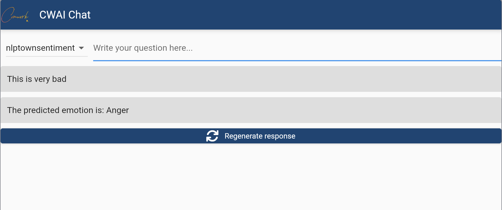
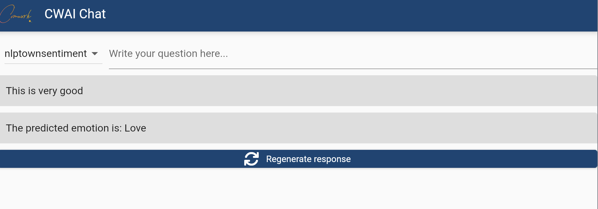

# CWAI-CHAT

This is a chat GUI for the [CWAI API](https://gitlab.comwork.io/oss/cwai/cwai-api).





## Git repositories

* Main repo: https://gitlab.comwork.io/oss/cwai/cwai-chat.git
* Github mirror: https://github.com/comworkio/cwai-chat.git
* Gitlab mirror: https://gitlab.com/ineumann/cwai-chat.git

## Getting started in localhost

First, create an environment variables file:

```shell
cp .env.dist .env # replace the values
```

```shell
docker-compose -f docker-compose-local.yml up --build --force-recreate
```

If you're on a MacOS (M1 or x86):

```shell
brew install flutter
./build.macos.sh
```

Then you'll be able to test on http://localhost:3000
